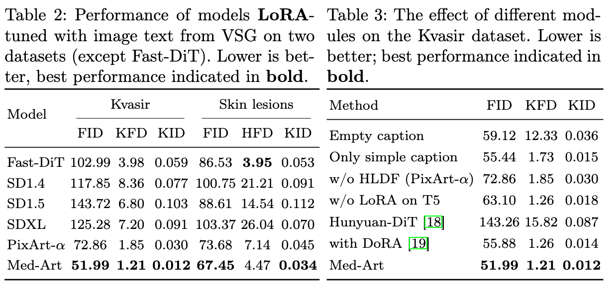

## Med-Art: Diffusion Transformer for Text-to-Image Generation in Medical Domain<br><sub>PyTorch Implementation</sub>


This repo features a PyTorch implementation for the paper [**Med-Art: Diffusion Transformer for Text-to-Image Generation in Medical Domain**]

It contains:


## Setup

First, download and set up the repo:

```bash
git clone https://anonymous.4open.science/r/medart-4986
cd medart
```

```bash
conda create -n medart python=3.10 -y
conda activate medart
```
* 🪐 Installation of **Llava-Next** and its dependencies, along with code for **image-to-text generation (Visual Symptom Generator)
  Ensure installation is performed in a GPU environment.
```bash
cd medart/LLaVA-NeXT
pip install -e ".[train]"
pip install flash-attn==2.4.1
```
Run VSG to generate visual descriptions of images.
```bash
python VSG.py
```
Save the generated CSV as metadata.csv (with the first column as file_name and the second column as text) under the train folder.

* 💥 Install diffusers.
Do not use the official diffusers here, as it is necessary to ensure that DPM Solver++ supports backpropagation.
```bash
cd medart
pip install -r requirements.txt
cd medart/diffusers
pip install .

```

## Training
The weights from PixArt-α will be downloaded automatically.
```bash
dataset_id="dataset/kvasir/train"
model_id=PixArt-alpha/PixArt-XL-2-512x512
accelerate launch  --mixed_precision="bf16" --num_processes=1 --main_process_port=36667  medart.py \
  --pretrained_model_name_or_path=$model_id \
  --dataset_name=$dataset_id \
  --caption_column="text" \
  --resolution=512 \
  --train_batch_size=1 \
  --num_train_epochs=15 \
  --rank=8 \
  --use_8bit_adam \
  --checkpointing_steps=12800 \
  --learning_rate=1e-04 \
  --lr_scheduler="constant" \
  --lr_warmup_steps=0 \
  --seed=42 \
  --output_dir="medart" \
  --gradient_checkpointing \
  --checkpoints_total_limit=10 \
  --max_token_length=120 \
  --M_times=20 \
  --N_steps=500 
```


## Generation
```bash
python sample.py
```
## Quantitative analysis.

